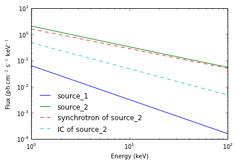

Additional features for scripts and applications
================================================

In this document we describe some features of the astromodels package
which are useful for non-interactive environment such as scripts or
applications

First let's import astromodels and let's load a model from a file, which
we will use as example:

.. code:: python

    from astromodels import *

.. code:: python

    my_model = load_model("my_model.yml")

Get dictionaries of point and extended sources
----------------------------------------------

If you don't know the details (such as names) of the sources contained
in the model, you can obtain dictionaries of point sources and extended
sources like:

.. code:: python

    point_sources = my_model.point_sources
    extended_sources = my_model.extended_sources
    
    # Print the names of the point sources
    print(point_sources.keys())
    
    # Print the names of the extended sources
    print(extended_sources.keys())

.. parsed-literal::

    ['source_1', 'source_2']
    []

You can use these dictionaries as usual. For example, you can loop over
all point sources and print their position:

.. code:: python

    for source_name, point_source in point_sources.iteritems():
        
        print("The model contain point source %s at %s" % (source_name, point_source.position))

.. parsed-literal::

    The model contain point source source_1 at Sky direction (R.A., Dec.) = (125.60000, -75.30000) (J2000)
    The model contain point source source_2 at Sky direction (l, b) = (11.25000, -22.50000) (J2000)

Accessing components and spectral shapes with no previous information
---------------------------------------------------------------------

Similarly you can access components and their spectral shapes (i.e.,
functions) without knowing the names in advance. A dictionary containing
the components of a given source can be obtained with:

.. code:: python

    components = my_model.source_2.components
    print(components.keys())

.. parsed-literal::

    ['synchrotron', 'IC']

So now we can loop over all the sources and print their components:

.. code:: python

    for source_name, point_source in my_model.point_sources.iteritems():
        
        print("Point source %s has components %s" % (source_name, point_source.components.keys()))

.. parsed-literal::

    Point source source_1 has components ['main']
    Point source source_2 has components ['synchrotron', 'IC']

With a fully-qualified path, you would need to know the name of the
function to access its parameters. Instead, you can use the generic name
"shape". For example these two statements point to the same function
instance:

.. code:: python

    my_model.source_1.spectrum.main.powerlaw == my_model.source_1.spectrum.main.shape

.. parsed-literal::

    True

Once you have a function instance, you can obtain a dictionary of its
parameters as:

.. code:: python

    parameters = my_model.source_1.spectrum.main.powerlaw.parameters
    print(parameters.keys())

.. parsed-literal::

    ['logK', 'piv', 'index']

Putting it all together, let's loop over all sources in our model, then
over each component in each source, then over each parameter in each
component:

.. code:: python

    for source_name, point_source in my_model.point_sources.iteritems():
        
        print("Found source %s" % source_name)
        
        print("  Position of point source: %s" % point_source.position)
        
        for component_name, component in point_source.components.iteritems():
            
            print("    Found component %s" % component_name)
            
            for parameter_name, parameter in component.shape.parameters.iteritems():
                
                print("      Found parameter %s" % parameter_name)

.. parsed-literal::

    Found source source_1
      Position of point source: Sky direction (R.A., Dec.) = (125.60000, -75.30000) (J2000)
        Found component main
          Found parameter logK
          Found parameter piv
          Found parameter index
    Found source source_2
      Position of point source: Sky direction (l, b) = (11.25000, -22.50000) (J2000)
        Found component synchrotron
          Found parameter logK
          Found parameter piv
          Found parameter index
        Found component IC
          Found parameter logK
          Found parameter piv
          Found parameter index

Let's now plot the differential flux between 1 and 100 keV of all
components from all sources:

.. code:: python

    import matplotlib.pyplot as plt
    
    # Comment this out if you are not using the IPython notebook
    %matplotlib inline
    
    # Prepare 100 energies logarithmicall spaced between 1 and 100 keV
    energies = np.logspace(0,2,100)
    
    # Now loop over all point sources and plot them
    for source_name, point_source in my_model.point_sources.iteritems():
        
        # Plot the sum of all components for this source
        
        plt.loglog(energies, point_source(energies),label=source_name)
        
        # If there is more than one component, plot them also separately
        
        if len(point_source.components) > 1:
        
            for component_name, component in point_source.components.iteritems():
            
                plt.loglog(energies,component.shape(energies),'--',label="%s of %s" %(component_name, source_name))
    
    # Add a legend
    plt.legend(loc=0,frameon=False)
    
    plt.xlabel("Energy (keV)")
    plt.ylabel(r"Flux (ph cm$^{-2}$ s$^{-1}$ keV$^{-1}$")

.. parsed-literal::

    <matplotlib.text.Text at 0x5f33b50>

Getting the path of an element and using it programmatically
------------------------------------------------------------

Whenever you have an element from the model, you can get its
fully-qualified path by using the .path property. This for example will
print the path of all the parameters in the model:

.. code:: python

    for source_name, point_source in my_model.point_sources.iteritems():
        
        for component_name, component in point_source.components.iteritems():
            
            for parameter_name, parameter in component.shape.parameters.iteritems():
                
                print(parameter.path)

.. parsed-literal::

    source_1.spectrum.main.powerlaw.logK
    source_1.spectrum.main.powerlaw.piv
    source_1.spectrum.main.powerlaw.index
    source_2.spectrum.synchrotron.powerlaw.logK
    source_2.spectrum.synchrotron.powerlaw.piv
    source_2.spectrum.synchrotron.powerlaw.index
    source_2.spectrum.IC.powerlaw.logK
    source_2.spectrum.IC.powerlaw.piv
    source_2.spectrum.IC.powerlaw.index

If you have a path of an element in a string, you can use it to access
the element by using the [] operator of the Model class like this:

.. code:: python

    my_path = 'source_2.spectrum.IC.powerlaw.logK'
    
    logK = my_model[my_path]
    
    print(logK)

.. parsed-literal::

    Parameter logK = -0.32
    (min_value = -40, max_value = 40, delta = 0.1, free = True)

Alternative way of accessing the information in the model
---------------------------------------------------------

We present here an alternative way to get information from the model
without using dictionaries, and using instead source IDs. A source ID is
just an ordinal number, separate for point sources and extended sources.
Hence, the first point source has ID 0, the second point source has ID
1, and so on. Similarly, the first extended source has ID 0, the second
has ID 1 and so on:

.. code:: python

    # Get the number of point sources and of extended sources
    
    n_pts = my_model.get_number_of_point_sources()
    n_ext = my_model.get_number_of_extended_sources()
    
    # Get the name of the first point source
    
    print("The first point source is called %s" % my_model.get_point_source_name(0))
    print("The second point source is called %s" % my_model.get_point_source_name(1))
    
    # Of course you can achieve the same in a loop
    
    for id in range(n_pts):
        
        print("Point source ID %s has name %s" % (id, my_model.get_point_source_name(id)))

.. parsed-literal::

    The first point source is called source_1
    The second point source is called source_2
    Point source ID 0 has name source_1
    Point source ID 1 has name source_2

Once you have the ID of a source, you can obtain information about it
with these methods of the Model class:

.. code:: python

    src_id = 1
    
    src_name = my_model.get_point_source_name(src_id)
    
    ra, dec = my_model.get_point_source_position(src_id) # This will always return ra,dec
    
    # Prepare 100 energies logarithmically spaced between 1 and 100 keV
    energies = np.logspace(0,2,100)
    
    differential_flux = my_model.get_point_source_fluxes(src_id, energies)
    
    # Similar methods exist for extended sources (to be completed)

Depending on your application you might find these methods more
convenient that interrogating the sources directly. Note however that
some features are not available through this interface. For example, it
is not possible to get information about different components through
these methods.

