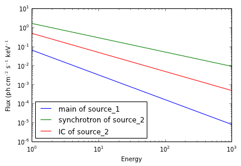
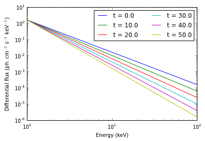

Model tutorial
==============

In this tutorial we show how to build a simple model with two point
sources, how to save it for later use, and re-load it back. We will also
plot the spectra of the two point sources, with their components.

See the documents about creating and getting information about
functions, point sources and extended sources for details about these
operations. Here we only focus on the global model.

.. code:: python

    from astromodels import *
    
    # We also import astropy units to show the unit-conversion
    # feature
    import astropy.units as u

Define sources
--------------

Now let's define a point source (see "Creating point sources" for
details and alternative way to accomplish this):

.. code:: python

    # Let's start by defining a simple point source with a power law spectrum
    
    pts1 = PointSource('source_1', ra=125.6, dec=-75.3, 
                       spectral_shape=powerlaw())
    
    # Get some info about what we just created
    pts1.display()

.. raw:: html

    <ul>
    
    <li>source_1 (point source): 
    <ul>
    
    <li>position: 
    <ul>
    
    <li>ra: 125.6</li>
    
    <li>dec: -75.3</li>
    
    <li>equinox: J2000</li>
    
    </ul>
    
    </li>
    
    <li>spectrum: 
    <ul>
    
    <li>main: 
    <ul>
    
    <li>powerlaw: 
    <ul>
    
    <li>logK: 0.0</li>
    
    <li>piv: 1.0</li>
    
    <li>index: -2.0</li>
    
    </ul>
    
    </li>
    
    </ul>
    
    </li>
    
    </ul>
    
    </li>
    
    </ul>
    
    </li>
    
    </ul>

Now let's define another source, this time at Galactic Coordinates l =
11.25, b = -22.5, and with two spectral components:

.. code:: python

    # Another point source with two spectral components
    
    spectrum1 = powerlaw(logK=0.2, index=-0.75)
    component1 = SpectralComponent('synchrotron',spectrum1)
    
    spectrum2 = powerlaw(logK=-0.8, index=-1.0)
    component2 = SpectralComponent('IC',spectrum2)
    
    point_source2 = PointSource('source_2', l=11.25, b=-22.5, components=[component1,component2])
    
    # Have a look at what we just created
    
    point_source2.display()

.. raw:: html

    <ul>
    
    <li>source_2 (point source): 
    <ul>
    
    <li>position: 
    <ul>
    
    <li>l: 11.25</li>
    
    <li>b: -22.5</li>
    
    <li>equinox: J2000</li>
    
    </ul>
    
    </li>
    
    <li>spectrum: 
    <ul>
    
    <li>synchrotron: 
    <ul>
    
    <li>powerlaw: 
    <ul>
    
    <li>logK: 0.2</li>
    
    <li>piv: 1.0</li>
    
    <li>index: -0.75</li>
    
    </ul>
    
    </li>
    
    </ul>
    
    </li>
    
    <li>IC: 
    <ul>
    
    <li>powerlaw: 
    <ul>
    
    <li>logK: -0.8</li>
    
    <li>piv: 1.0</li>
    
    <li>index: -1.0</li>
    
    </ul>
    
    </li>
    
    </ul>
    
    </li>
    
    </ul>
    
    </li>
    
    </ul>
    
    </li>
    
    </ul>

Create a model
--------------

Now let's create our model, which comprises our two sources:

.. code:: python

    # Build a model with the two point sources
    
    my_model = Model(pts1, point_source2)

Of course you can use as many sources as needed, like my\_model =
Model(pts1, pts2, pts3...)

Getting information about a model
---------------------------------

Using the .display() method we can see all free parameters currently in
the model:

.. code:: python

    my_model.display()

.. raw:: html

    Point sources: source_1,source_2  Extended sources: (none)  Free parameters: <table id="table65283408">
    <thead><tr><th>name</th><th>value</th><th>min_value</th><th>max_value</th><th>delta</th><th>free</th></tr></thead>
    <tr><td>source_1.spectrum.main.powerlaw.logK</td><td>0.0</td><td>-40</td><td>40</td><td>0.1</td><td>True</td></tr>
    <tr><td>source_1.spectrum.main.powerlaw.index</td><td>-2.0</td><td>-10</td><td>10</td><td>0.2</td><td>True</td></tr>
    <tr><td>source_2.spectrum.synchrotron.powerlaw.logK</td><td>0.2</td><td>-40</td><td>40</td><td>0.1</td><td>True</td></tr>
    <tr><td>source_2.spectrum.synchrotron.powerlaw.index</td><td>-0.75</td><td>-10</td><td>10</td><td>0.2</td><td>True</td></tr>
    <tr><td>source_2.spectrum.IC.powerlaw.logK</td><td>-0.8</td><td>-40</td><td>40</td><td>0.1</td><td>True</td></tr>
    <tr><td>source_2.spectrum.IC.powerlaw.index</td><td>-1.0</td><td>-10</td><td>10</td><td>0.2</td><td>True</td></tr>
    </table>

A dictionary of free parameters can be obtained like this:

.. code:: python

    free_parameters = my_model.free_parameters

We can use such dictionary to loop over all free parameters:

.. code:: python

    for parameter_name, parameter in free_parameters.iteritems():
        
        print("Parameter %s is free" % parameter_name)

.. parsed-literal::

    Parameter source_1.spectrum.main.powerlaw.logK is free
    Parameter source_1.spectrum.main.powerlaw.index is free
    Parameter source_2.spectrum.synchrotron.powerlaw.logK is free
    Parameter source_2.spectrum.synchrotron.powerlaw.index is free
    Parameter source_2.spectrum.IC.powerlaw.logK is free
    Parameter source_2.spectrum.IC.powerlaw.index is free

More information on a particular source can be obtained like:

.. code:: python

    my_model.source_1.display()

.. raw:: html

    <ul>
    
    <li>source_1 (point source): 
    <ul>
    
    <li>position: 
    <ul>
    
    <li>ra: 125.6</li>
    
    <li>dec: -75.3</li>
    
    <li>equinox: J2000</li>
    
    </ul>
    
    </li>
    
    <li>spectrum: 
    <ul>
    
    <li>main: 
    <ul>
    
    <li>powerlaw: 
    <ul>
    
    <li>logK: 0.0</li>
    
    <li>piv: 1.0</li>
    
    <li>index: -2.0</li>
    
    </ul>
    
    </li>
    
    </ul>
    
    </li>
    
    </ul>
    
    </li>
    
    </ul>
    
    </li>
    
    </ul>

More information about a particular instance of a function can be
obtained like:

.. code:: python

    my_model.source_1.spectrum.main.powerlaw.display()

.. raw:: html

    <ul>
    
    <li>description: A simple power-law with normalization expressed as a logarithm</li>
    
    <li>formula: $ \frac{dN}{dx} = 10^{logK}~\frac{x}{piv}^{index} $</li>
    
    <li>parameters: 
    <ul>
    
    <li>logK: 
    <ul>
    
    <li>value: 0.0</li>
    
    <li>min_value: -40</li>
    
    <li>max_value: 40</li>
    
    <li>unit: dex(1 / (cm2 keV s))</li>
    
    <li>delta: 0.1</li>
    
    <li>free: True</li>
    
    </ul>
    
    </li>
    
    <li>piv: 
    <ul>
    
    <li>value: 1.0</li>
    
    <li>min_value: None</li>
    
    <li>max_value: None</li>
    
    <li>unit: keV</li>
    
    <li>delta: 0.1</li>
    
    <li>free: False</li>
    
    </ul>
    
    </li>
    
    <li>index: 
    <ul>
    
    <li>value: -2.0</li>
    
    <li>min_value: -10</li>
    
    <li>max_value: 10</li>
    
    <li>unit: </li>
    
    <li>delta: 0.2</li>
    
    <li>free: True</li>
    
    </ul>
    
    </li>
    
    </ul>
    
    </li>
    
    </ul>

Accessing and modifying sources and parameters from the model instance
----------------------------------------------------------------------

Fully-qualified paths
~~~~~~~~~~~~~~~~~~~~~

Each source and each parameter has a precise path within the model.
These paths are displayed by the .display() method of the model instance
(see above), and can be used like my\_model.[path]. For example:

.. code:: python

    my_model.display()

.. raw:: html

    Point sources: source_1,source_2  Extended sources: (none)  Free parameters: <table id="table65954192">
    <thead><tr><th>name</th><th>value</th><th>min_value</th><th>max_value</th><th>delta</th><th>free</th></tr></thead>
    <tr><td>source_1.spectrum.main.powerlaw.logK</td><td>0.0</td><td>-40</td><td>40</td><td>0.1</td><td>True</td></tr>
    <tr><td>source_1.spectrum.main.powerlaw.index</td><td>-2.0</td><td>-10</td><td>10</td><td>0.2</td><td>True</td></tr>
    <tr><td>source_2.spectrum.synchrotron.powerlaw.logK</td><td>0.2</td><td>-40</td><td>40</td><td>0.1</td><td>True</td></tr>
    <tr><td>source_2.spectrum.synchrotron.powerlaw.index</td><td>-0.75</td><td>-10</td><td>10</td><td>0.2</td><td>True</td></tr>
    <tr><td>source_2.spectrum.IC.powerlaw.logK</td><td>-0.8</td><td>-40</td><td>40</td><td>0.1</td><td>True</td></tr>
    <tr><td>source_2.spectrum.IC.powerlaw.index</td><td>-1.0</td><td>-10</td><td>10</td><td>0.2</td><td>True</td></tr>
    </table>

.. code:: python

    # Access the logK parameters of the powerlaw spectrum of the main component for source 1:
    
    my_model.source_1.spectrum.main.powerlaw.logK = -0.5
    
    # Access the logK parameters of the spectrum of the IC component of source 2:
    
    my_model.source_2.spectrum.IC.powerlaw.logK = -0.32

The structure of these paths is easy to understand. The model is a
tree-like structure. The root of the tree is always the model instance
itself. The second level is constituted by the various sources. The
structure within a source can be understood by calling the .display
method:

.. code:: python

    my_model.source_1.display()

.. raw:: html

    <ul>
    
    <li>source_1 (point source): 
    <ul>
    
    <li>position: 
    <ul>
    
    <li>ra: 125.6</li>
    
    <li>dec: -75.3</li>
    
    <li>equinox: J2000</li>
    
    </ul>
    
    </li>
    
    <li>spectrum: 
    <ul>
    
    <li>main: 
    <ul>
    
    <li>powerlaw: 
    <ul>
    
    <li>logK: -0.5</li>
    
    <li>piv: 1.0</li>
    
    <li>index: -2.0</li>
    
    </ul>
    
    </li>
    
    </ul>
    
    </li>
    
    </ul>
    
    </li>
    
    </ul>
    
    </li>
    
    </ul>

Each indentation represents one level, so to access the "ra" element we
can follow the levels shown by the .display() method:

.. code:: python

    ra_parameter = my_model.source_1.position.ra
    
    ra_parameter.display()
    
    # NOTE: this is a Parameter instance. To get the position of the source as a
    # floating point number, use:
    # my_model.source_1.position.get_ra()
    # which will work for any source

.. raw:: html

    Parameter ra = 125.6
    (min_value = 0.0, max_value = 360.0, delta = 12.56, free = False)

while to access the index parameter of the power law function we can do:

.. code:: python

    logK_parameter = my_model.source_1.spectrum.main.powerlaw.logK
    
    logK_parameter.display()

.. raw:: html

    Parameter logK = -0.5
    (min_value = -40, max_value = 40, delta = 0.1, free = True)

Finally, there is an alternative way of using paths, which might be more
adapt for scripts:

.. code:: python

    my_model['source_1.spectrum.main.powerlaw.logK'].display()

.. raw:: html

    Parameter logK = -0.5
    (min_value = -40, max_value = 40, delta = 0.1, free = True)

You can find much more information in the document "Additional features
for scripts and applications".

These fully-qualified paths are unique to each element, are very
descriptive and easy to understand. They can always be used and are
encouraged in general, but especially in scripts, when the effort spent
writing them is paid off in terms of clarity. However, there is an
alternative way which might be more convenient in certain situation,
especially when models are simple and the chances of getting confused
are low. This alternative method is described below.

Using shortcuts
~~~~~~~~~~~~~~~

Exploiting the feature of the python language, we can create names
("shortcuts") for objects:

.. code:: python

    # Create a "shortcut" for the spectrum of a source
    
    powerlaw_1 = my_model.source_1.spectrum.main.powerlaw
    
    # Now we can change the values of that power law as:
    powerlaw_1.logK = -1.2
    
    # GOTCHA: while it is possible to create shortcuts for parameters, it is not encouraged
    # Indeed, this will not work:
    # logK_1 = my_model.source_1.spectrum.main.powerlaw.logK
    # logK_1 = -1.2 # WILL NOT WORK
    # In order to use a shortcut for a parameter to change its value, you have to explicitly
    # set its property 'value':
    # logK_1.value = -1.2 # This will work

Shortcut can point at any point of the tree:

.. code:: python

    # Create a shortcut of a source
    source_1 = my_model.source_1
    
    # Now we can do:
    source_1.spectrum.main.powerlaw.index = -2.3
    
    # Create a shortcut for a component
    
    main_component = my_model.source_1.spectrum.main
    
    # Now we can do:
    main_component.powerlaw.index = -1.3

If you are ever in doubt of what a particular shortcut stands for, you
can always retrieve the full path of the element the shortcut is
pointing to like this:

.. code:: python

    print(main_component.path)

.. parsed-literal::

    source_1.spectrum.main

Saving a model to file
----------------------

An existing model can be saved to a file with:

.. code:: python

    # Save the model to a file, overwriting it if already existing
    
    my_model.save('my_model.yml', overwrite=True)

The content of the file is YAML code, which is human-readable and very
easy to understand. Let's have a look:

.. code:: python

    with open('my_model.yml') as yaml_file:
        
        print("".join(yaml_file.readlines()))

.. parsed-literal::

    source_1 (point source):
    
      position:
    
        ra: {value: 125.6, min_value: 0.0, max_value: 360.0, unit: '', delta: 12.56, free: false}
    
        dec: {value: -75.3, min_value: -90.0, max_value: 90.0, unit: '', delta: 7.53,
    
          free: false}
    
        equinox: J2000
    
      spectrum:
    
        main:
    
          powerlaw:
    
            logK: {value: -1.2, min_value: -40, max_value: 40, unit: dex(1 / (cm2 keV
    
                s)), delta: 0.1, free: true}
    
            piv: {value: 1.0, min_value: null, max_value: null, unit: keV, delta: 0.1,
    
              free: false}
    
            index: {value: -1.3, min_value: -10, max_value: 10, unit: '', delta: 0.2,
    
              free: true}
    
          polarization: {}
    
    source_2 (point source):
    
      position:
    
        l: {value: 11.25, min_value: 0.0, max_value: 360.0, unit: '', delta: 1.125, free: false}
    
        b: {value: -22.5, min_value: -90.0, max_value: 90.0, unit: '', delta: 2.25, free: false}
    
        equinox: J2000
    
      spectrum:
    
        synchrotron:
    
          powerlaw:
    
            logK: {value: 0.2, min_value: -40, max_value: 40, unit: dex(1 / (cm2 keV s)),
    
              delta: 0.1, free: true}
    
            piv: {value: 1.0, min_value: null, max_value: null, unit: keV, delta: 0.1,
    
              free: false}
    
            index: {value: -0.75, min_value: -10, max_value: 10, unit: '', delta: 0.2,
    
              free: true}
    
          polarization: {}
    
        IC:
    
          powerlaw:
    
            logK: {value: -0.32, min_value: -40, max_value: 40, unit: dex(1 / (cm2 keV
    
                s)), delta: 0.1, free: true}
    
            piv: {value: 1.0, min_value: null, max_value: null, unit: keV, delta: 0.1,
    
              free: false}
    
            index: {value: -1.0, min_value: -10, max_value: 10, unit: '', delta: 0.2,
    
              free: true}
    
          polarization: {}
    
    

Load a model from a file
------------------------

Now suppose that you want to load back a file you created in a previous
session. You can do it with:

.. code:: python

    my_model = load_model('my_model.yml')
    
    # Explore the model we just loaded back
    
    my_model.display()

.. raw:: html

    Point sources: source_1,source_2  Extended sources: (none)  Free parameters: <table id="table66045840">
    <thead><tr><th>name</th><th>value</th><th>min_value</th><th>max_value</th><th>delta</th><th>free</th></tr></thead>
    <tr><td>source_1.spectrum.main.powerlaw.logK</td><td>-1.2</td><td>-40</td><td>40</td><td>0.1</td><td>True</td></tr>
    <tr><td>source_1.spectrum.main.powerlaw.index</td><td>-1.3</td><td>-10</td><td>10</td><td>0.2</td><td>True</td></tr>
    <tr><td>source_2.spectrum.synchrotron.powerlaw.logK</td><td>0.2</td><td>-40</td><td>40</td><td>0.1</td><td>True</td></tr>
    <tr><td>source_2.spectrum.synchrotron.powerlaw.index</td><td>-0.75</td><td>-10</td><td>10</td><td>0.2</td><td>True</td></tr>
    <tr><td>source_2.spectrum.IC.powerlaw.logK</td><td>-0.32</td><td>-40</td><td>40</td><td>0.1</td><td>True</td></tr>
    <tr><td>source_2.spectrum.IC.powerlaw.index</td><td>-1.0</td><td>-10</td><td>10</td><td>0.2</td><td>True</td></tr>
    </table>

.. code:: python

    # Now evaluate and plot our models. You need matplotlib for this
    
    import matplotlib.pyplot as plt
    
    %matplotlib inline
    
    # Energies where we want to evaluate the model
    
    e = np.logspace(0,3,100)
    
    # Loop over the sources
    
    for src_name, src in my_model.point_sources.iteritems():
        
        # Loop over the components of each source
        
        for comp_name, component in src.components.iteritems():
            
            # Get the differential flux (in ph/cm2/s)
            
            flux = component.shape(e)
            
            # this can also be accomplished with:
            # flux = component.powerlaw(e)
            # but this requires to know the name of the
            # spectral shape which was used
            
            # Plot this component for this source
            
            plt.plot(e, flux,label="%s of %s" % (component.name, src.name))
    
    plt.legend(loc=0)
    plt.loglog()
    plt.xlabel("Energy")
    plt.ylabel(r"Flux (ph cm$^{-2}$ s$^{-1}$ keV$^{-1}$")

.. parsed-literal::

    <matplotlib.text.Text at 0x49591d0>

Linking parameters
------------------

Sometimes you want to link two parameters of a model so that they have
the same value. This can be easily accomplished in astromodels:

.. code:: python

    # Link the photon index of the first source with the
    # photon index of the IC component of the second source
    
    my_model.link(my_model.source_2.spectrum.IC.powerlaw.index,
                  my_model.source_1.spectrum.main.powerlaw.index)
    
    my_model.display()

.. raw:: html

    Point sources: source_1,source_2  Extended sources: (none)  Free parameters: <table id="table65954064">
    <thead><tr><th>name</th><th>value</th><th>min_value</th><th>max_value</th><th>delta</th><th>free</th></tr></thead>
    <tr><td>source_1.spectrum.main.powerlaw.logK</td><td>-1.2</td><td>-40</td><td>40</td><td>0.1</td><td>True</td></tr>
    <tr><td>source_1.spectrum.main.powerlaw.index</td><td>-1.3</td><td>-10</td><td>10</td><td>0.2</td><td>True</td></tr>
    <tr><td>source_2.spectrum.synchrotron.powerlaw.logK</td><td>0.2</td><td>-40</td><td>40</td><td>0.1</td><td>True</td></tr>
    <tr><td>source_2.spectrum.synchrotron.powerlaw.index</td><td>-0.75</td><td>-10</td><td>10</td><td>0.2</td><td>True</td></tr>
    <tr><td>source_2.spectrum.IC.powerlaw.logK</td><td>-0.32</td><td>-40</td><td>40</td><td>0.1</td><td>True</td></tr>
    </table>  Linked parameters: <table id="table65957328">
    <thead><tr><th>name</th><th>linked to</th><th>function</th><th>current value</th></tr></thead>
    <tr><td>source_2.spectrum.IC.powerlaw.index</td><td>source_1.spectrum.main.powerlaw.index</td><td>identity</td><td>-1.3</td></tr>
    </table>

Advanced use of linking: arbitrary functions
~~~~~~~~~~~~~~~~~~~~~~~~~~~~~~~~~~~~~~~~~~~~

Astromodels takes this a step further. Parameters can be linked to each
other through any function. The parameters of the linking function
become parameters of the model like any other, and can be left free to
vary or fixed. For example, let's consider the case where we want the
photon index of the IC component of the second source (p2) to be equal
to the photon index of the first source (p1) plus a constant. We can
link the two parameters with the 'bias' function f(x) = x + k, so that
p2(p1) = p1 + k:

.. code:: python

    # Link the photon indexes through the 'bias' function, i.e.,
    # the photon index of the IC component of the second source is fixed to be the
    # photon index of the first source plus a constant k
    
    link_function = bias()
    
    my_model.link(my_model.source_2.spectrum.IC.powerlaw.index,
                  my_model.source_1.spectrum.main.powerlaw.index,
                  link_function)
    
    # The parameters of the linking function become parameters
    # of the model, and are put in the model tree under the parameter they are
    # linking.
    # In this case the only parameter of the 'bias' function ('k') becomes then
    # my_model.source_2.spectrum.IC.powerlaw.logK.bias.k
    
    my_model.display()

.. raw:: html

    Point sources: source_1,source_2  Extended sources: (none)  Free parameters: <table id="table65957840">
    <thead><tr><th>name</th><th>value</th><th>min_value</th><th>max_value</th><th>delta</th><th>free</th></tr></thead>
    <tr><td>source_1.spectrum.main.powerlaw.logK</td><td>-1.2</td><td>-40</td><td>40</td><td>0.1</td><td>True</td></tr>
    <tr><td>source_1.spectrum.main.powerlaw.index</td><td>-1.3</td><td>-10</td><td>10</td><td>0.2</td><td>True</td></tr>
    <tr><td>source_2.spectrum.synchrotron.powerlaw.logK</td><td>0.2</td><td>-40</td><td>40</td><td>0.1</td><td>True</td></tr>
    <tr><td>source_2.spectrum.synchrotron.powerlaw.index</td><td>-0.75</td><td>-10</td><td>10</td><td>0.2</td><td>True</td></tr>
    <tr><td>source_2.spectrum.IC.powerlaw.logK</td><td>-0.32</td><td>-40</td><td>40</td><td>0.1</td><td>True</td></tr>
    <tr><td>source_2.spectrum.IC.powerlaw.index.bias.k</td><td>0.0</td><td>None</td><td>None</td><td>0.1</td><td>True</td></tr>
    </table>  Linked parameters: <table id="table82002384">
    <thead><tr><th>name</th><th>linked to</th><th>function</th><th>current value</th></tr></thead>
    <tr><td>source_2.spectrum.IC.powerlaw.index</td><td>source_1.spectrum.main.powerlaw.index</td><td>bias</td><td>-1.3</td></tr>
    </table>

If we want to fix say p2 = p1 - 1.2, we can fix k to that:

.. code:: python

    my_model.source_2.spectrum.IC.powerlaw.index.bias.k = -1.2
    my_model.source_2.spectrum.IC.powerlaw.index.bias.k.fix = True
    
    my_model.display()

.. raw:: html

    Point sources: source_1,source_2  Extended sources: (none)  Free parameters: <table id="table65956368">
    <thead><tr><th>name</th><th>value</th><th>min_value</th><th>max_value</th><th>delta</th><th>free</th></tr></thead>
    <tr><td>source_1.spectrum.main.powerlaw.logK</td><td>-1.2</td><td>-40</td><td>40</td><td>0.1</td><td>True</td></tr>
    <tr><td>source_1.spectrum.main.powerlaw.index</td><td>-1.3</td><td>-10</td><td>10</td><td>0.2</td><td>True</td></tr>
    <tr><td>source_2.spectrum.synchrotron.powerlaw.logK</td><td>0.2</td><td>-40</td><td>40</td><td>0.1</td><td>True</td></tr>
    <tr><td>source_2.spectrum.synchrotron.powerlaw.index</td><td>-0.75</td><td>-10</td><td>10</td><td>0.2</td><td>True</td></tr>
    <tr><td>source_2.spectrum.IC.powerlaw.logK</td><td>-0.32</td><td>-40</td><td>40</td><td>0.1</td><td>True</td></tr>
    </table>  Linked parameters: <table id="table81992272">
    <thead><tr><th>name</th><th>linked to</th><th>function</th><th>current value</th></tr></thead>
    <tr><td>source_2.spectrum.IC.powerlaw.index</td><td>source_1.spectrum.main.powerlaw.index</td><td>bias</td><td>-2.5</td></tr>
    </table>

As another example, we might link the two parameters using a power law
function:

.. code:: python

    my_model.link(my_model.source_2.spectrum.IC.powerlaw.index,
                  my_model.source_1.spectrum.main.powerlaw.index,
                  powerlaw())
    
    my_model.display()

.. raw:: html

    Point sources: source_1,source_2  Extended sources: (none)  Free parameters: <table id="table65957264">
    <thead><tr><th>name</th><th>value</th><th>min_value</th><th>max_value</th><th>delta</th><th>free</th></tr></thead>
    <tr><td>source_1.spectrum.main.powerlaw.logK</td><td>-1.2</td><td>-40</td><td>40</td><td>0.1</td><td>True</td></tr>
    <tr><td>source_1.spectrum.main.powerlaw.index</td><td>-1.3</td><td>-10</td><td>10</td><td>0.2</td><td>True</td></tr>
    <tr><td>source_2.spectrum.synchrotron.powerlaw.logK</td><td>0.2</td><td>-40</td><td>40</td><td>0.1</td><td>True</td></tr>
    <tr><td>source_2.spectrum.synchrotron.powerlaw.index</td><td>-0.75</td><td>-10</td><td>10</td><td>0.2</td><td>True</td></tr>
    <tr><td>source_2.spectrum.IC.powerlaw.logK</td><td>-0.32</td><td>-40</td><td>40</td><td>0.1</td><td>True</td></tr>
    <tr><td>source_2.spectrum.IC.powerlaw.index.powerlaw.logK</td><td>0.0</td><td>-40</td><td>40</td><td>0.1</td><td>True</td></tr>
    <tr><td>source_2.spectrum.IC.powerlaw.index.powerlaw.index</td><td>-2.0</td><td>-10</td><td>10</td><td>0.2</td><td>True</td></tr>
    </table>  Linked parameters: <table id="table80112528">
    <thead><tr><th>name</th><th>linked to</th><th>function</th><th>current value</th></tr></thead>
    <tr><td>source_2.spectrum.IC.powerlaw.index</td><td>source_1.spectrum.main.powerlaw.index</td><td>powerlaw</td><td>0.591715976331</td></tr>
    </table>

We can use arbitrarily complex functions as link function, if needed
(see "Creating and modifying functions" for more info on how to create
composite functions):

.. code:: python

    # A random composite function (see "Creating and modifying functions" for more info)
    crazy_link = powerlaw() + gaussian()
    
    my_model.link(my_model.source_2.spectrum.IC.powerlaw.index,
                  my_model.source_1.spectrum.main.powerlaw.index,
                  crazy_link)
    
    my_model.display()

.. raw:: html

    Point sources: source_1,source_2  Extended sources: (none)  Free parameters: <table id="table66045456">
    <thead><tr><th>name</th><th>value</th><th>min_value</th><th>max_value</th><th>delta</th><th>free</th></tr></thead>
    <tr><td>source_1.spectrum.main.powerlaw.logK</td><td>-1.2</td><td>-40</td><td>40</td><td>0.1</td><td>True</td></tr>
    <tr><td>source_1.spectrum.main.powerlaw.index</td><td>-1.3</td><td>-10</td><td>10</td><td>0.2</td><td>True</td></tr>
    <tr><td>source_2.spectrum.synchrotron.powerlaw.logK</td><td>0.2</td><td>-40</td><td>40</td><td>0.1</td><td>True</td></tr>
    <tr><td>source_2.spectrum.synchrotron.powerlaw.index</td><td>-0.75</td><td>-10</td><td>10</td><td>0.2</td><td>True</td></tr>
    <tr><td>source_2.spectrum.IC.powerlaw.logK</td><td>-0.32</td><td>-40</td><td>40</td><td>0.1</td><td>True</td></tr>
    <tr><td>source_2.spectrum.IC.powerlaw.index.powerlaw.logK</td><td>0.0</td><td>-40</td><td>40</td><td>0.1</td><td>True</td></tr>
    <tr><td>source_2.spectrum.IC.powerlaw.index.powerlaw.index</td><td>-2.0</td><td>-10</td><td>10</td><td>0.2</td><td>True</td></tr>
    <tr><td>source_2.spectrum.IC.powerlaw.index.composite.logK</td><td>0.0</td><td>-40</td><td>40</td><td>0.1</td><td>True</td></tr>
    <tr><td>source_2.spectrum.IC.powerlaw.index.composite.index</td><td>-2.0</td><td>-10</td><td>10</td><td>0.2</td><td>True</td></tr>
    <tr><td>source_2.spectrum.IC.powerlaw.index.composite.mu</td><td>0.0</td><td>None</td><td>None</td><td>0.1</td><td>True</td></tr>
    <tr><td>source_2.spectrum.IC.powerlaw.index.composite.sigma</td><td>1.0</td><td>None</td><td>None</td><td>0.1</td><td>True</td></tr>
    </table>  Linked parameters: <table id="table81953040">
    <thead><tr><th>name</th><th>linked to</th><th>function</th><th>current value</th></tr></thead>
    <tr><td>source_2.spectrum.IC.powerlaw.index</td><td>source_1.spectrum.main.powerlaw.index</td><td>composite</td><td>1.02127333454</td></tr>
    </table>

Time-varying models and other independent variables
---------------------------------------------------

In astromodels parameters can become functions of independent variables
such as time. This is accomplished in a way which is similar to the
procedure to link parameters described above. First, let's create an
independent variable. An IndependentVariable instance is created and
added to the model like this:

.. code:: python

    # Add the time as an independent variable of the model
    
    time = IndependentVariable("time",0.0, unit='s')
    
    my_model.add_independent_variable(time)

The IndependentVariable instance is inserted at the root of the model
tree. In this case, can be accessed as:

.. code:: python

    my_model.time.display()

.. raw:: html

    IndependentVariable time = 0.0
    (min_value = None, max_value = None)

We can now link any parameter to be a function of time, like this:

.. code:: python

    # First define the function. In this case, a linear function ax+b
    law = line(a=-0.02,b=-2.0)
    
    # Now link the index of the sync. component of source_2 to be law(t)
    # i.e., index = law(t) = a*t + b
    
    my_model.link(my_model.source_2.spectrum.synchrotron.powerlaw.index,
                 time,
                 law)

.. code:: python

    my_model.save("time_dependent.yml",overwrite=True)
    
    my_model = load_model("time_dependent.yml")

.. parsed-literal::

    (0,0,0,)

.. code:: python

    # This would show the link:
    # my_model.display()
    
    # Now changing the value of time will change the value of the parameter
    # according to the law. For example, let's loop over 10 s and print
    # the value of the parameter
    
    # Reset time
    my_model.time = 0.0
    
    for i in range(10):
        
        my_model.time = my_model.time.value + 1.0
        
        print("At time %s s the value of the parameter is %s" % (my_model.time.value, 
                        my_model.source_2.spectrum.synchrotron.powerlaw.index.value))

.. parsed-literal::

    At time 1.0 s the value of the parameter is -2.02
    At time 2.0 s the value of the parameter is -2.04
    At time 3.0 s the value of the parameter is -2.06
    At time 4.0 s the value of the parameter is -2.08
    At time 5.0 s the value of the parameter is -2.1
    At time 6.0 s the value of the parameter is -2.12
    At time 7.0 s the value of the parameter is -2.14
    At time 8.0 s the value of the parameter is -2.16
    At time 9.0 s the value of the parameter is -2.18
    At time 10.0 s the value of the parameter is -2.2

.. code:: python

    # Now plot the synch. spectrum of the source at different times
    # (you will need matplotlib for this)
    
    import matplotlib.pyplot as plt
    
    # This is needed only in the ipython notebook
    %matplotlib inline
    
    # Prepare 100 logarithmically distributed energies between 1 and 100 keV
    energies = np.logspace(0,2,100)
    
    # Compute and plot the sync. spectrum every 10 s between 0 and 50 seconds
    
    times = np.linspace(0,50,6)
    
    my_model.time = 0.0
    
    for tt in times:
        
        my_model.time = tt
        
        plt.loglog(energies, my_model.source_2.spectrum.synchrotron(energies),label='t = %s' % my_model.time.value)
    
    plt.legend(loc=1,ncol=2)
    plt.xlabel("Energy (keV)")
    plt.ylabel(r"Differential flux (ph. cm$^{-2}$ s$^{-1}$ keV$^{-1}$)")

.. parsed-literal::

    <matplotlib.text.Text at 0x4ff2f50>

